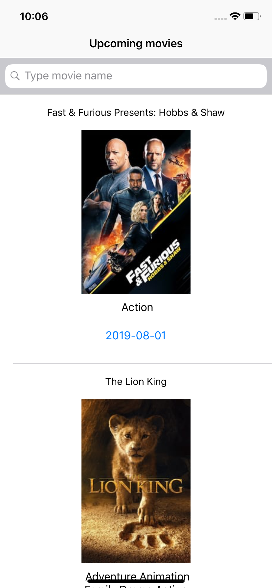
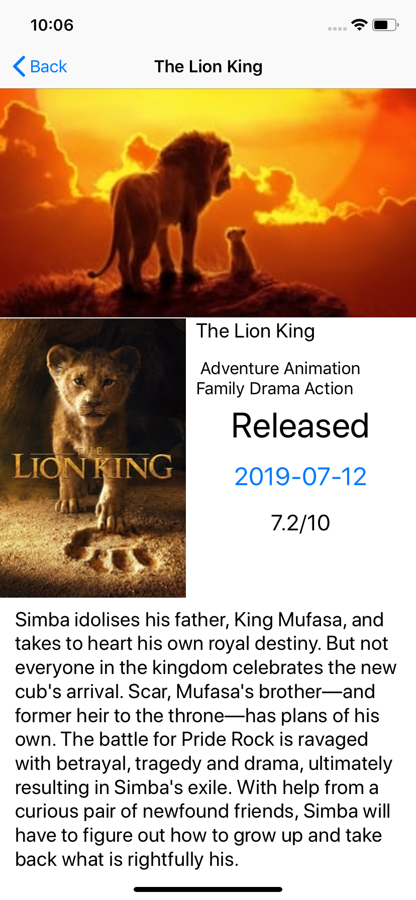

# ArcTouch Code Challenge

## Basic info

This project was made using Swift 4 and XCode 10.3. The main theme of app is show the upcoming movies. The data used was provided by [The Movie Database API](https://developers.themoviedb.org).

The app can:
- Show the upcoming movies;
- See the details from a selected movie
- Search movies localy

Main Screen


Detail Screen



## Build
The project was build using cocoapods. Then this command will be very useful:

```bash
  pod install
```

## Third-party libraries

### Alamofire

Used in way to make requests. Alamofire is very simple to [use](https://github.com/Alamofire/Alamofire/blob/master/Documentation/Usage.md).

### AlamofireObjectMapper

Used to make models based in API. This make the process be easier to receive the response data from each enpoint.

To use the Object Mapper is simple:
  1. Import ObjectMapper
  2. Enhrites the class from Mappable
  3. Add all data to be requested in variables
  4. Implement the Map function
  5. Use like response in Alamofire requests.

Exemple of this are in the Model folder.

### Alamofire-Synchronous (V4.0)

Used in the same way of Alamofire. But can be use for Synchronous request. The way to use could be found [here](https://github.com/Dalodd/Alamofire-Synchronous)
